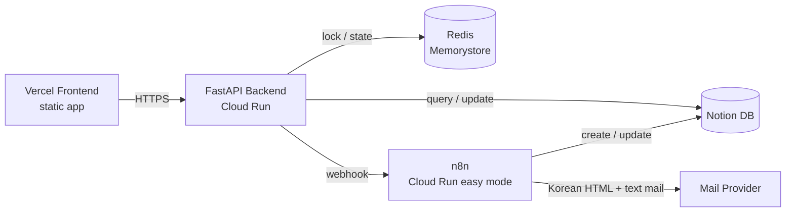

# 스마트 타임랩스 온보딩 프로젝트

이 저장소는 `문의 등록 -> 관리자 처리 -> 완료 알림` 흐름을 구현한 Q&A 서비스입니다. 현재 저장소에는 프론트엔드, FastAPI 백엔드, n8n 워크플로우 export, Notion/Redis/Cloud Run 자동화 스크립트가 함께 포함되어 있습니다.

핵심 구조는 아래 4가지입니다.

1. 문의의 정본 저장소는 `Notion DB`입니다.
2. `FastAPI Backend`가 입력 검증, 관리자 인증, Redis 기반 동시성 제어, n8n 호출을 담당합니다.
3. `n8n`이 Notion 저장/업데이트와 한국어 메일 발송을 담당합니다.
4. `Redis`는 동일 문의의 동시 중복 등록과 관리자 상태 변경 직렬화를 담당합니다.


## 1. 과제 요구사항 대응 요약

현재 구현 범위는 아래를 포함합니다.

- 공개 문의 등록 API
- 관리자 로그인 및 세션 유지 API
- 관리자 문의 조회/상세/상태 변경 API
- 문의 등록 시 n8n 등록 workflow 호출
- 문의 완료 시 n8n 완료 workflow 호출
- Notion DB 저장 및 상태/처리 결과 반영
- 관리자/문의자 메일 발송
- `이름 + 제목` 기준 중복 등록 방지
- 동시 요청 상황에서 Redis 잠금 기반 중복 제어
- 프론트엔드 정적 앱 및 Vercel 배포

## 2. 아키텍처 한눈에 보기



백엔드는 Redis와 Notion을 직접 사용하고, 등록/완료 workflow와 메일 발송은 n8n에 위임합니다.

### 역할 분리

- 프론트엔드: 공개 문의 등록 화면과 관리자 화면을 제공하고 백엔드 API만 호출합니다.
- 백엔드: 입력 검증, 관리자 인증, Redis 상태 관리, n8n webhook 호출을 담당합니다.
- Redis: 문의 등록 상호배제, dedup 상태 추적, 관리자 상태 변경 직렬화를 담당합니다.
- n8n: Notion 저장/업데이트와 한국어 `HTML + text` 메일 발송을 담당합니다.
- Notion DB: 문의 정본 저장소입니다.

관련 결정은 ADR에 정리되어 있습니다.

- [ADR 인덱스](/home/soonvro/Projects/01_Active/smart_timelabs_onboarding/docs/adr/000_index.md)
- [ADR 005](/home/soonvro/Projects/01_Active/smart_timelabs_onboarding/docs/adr/005_문의_주_저장소로_Notion_DB_사용_및_Redis_동시성_제어_채택.md)
- [ADR 006](/home/soonvro/Projects/01_Active/smart_timelabs_onboarding/docs/adr/006_n8n_배포_전략으로_Cloud_Run_easy_mode_채택.md)

## 3. 핵심 플로우

### 문의 등록

1. 백엔드가 입력값을 검증합니다.
2. `이름 + 제목`으로 `dedup_key`를 계산합니다.
3. Redis `lock:inquiry:{dedup_key}`를 획득합니다.
4. Redis 상태와 Notion `DedupKey`를 확인해 중복 여부를 판정합니다.
5. 중복이 아니면 백엔드가 n8n 등록 workflow를 호출합니다.
6. n8n이 Notion 페이지를 만들고 관리자 메일을 보냅니다.
7. 백엔드는 Redis 상태를 `confirmed`로 확정합니다.

### 관리자 상태 변경

1. 백엔드가 Redis `lock:page:{notion_page_id}`를 획득합니다.
2. `처리중`은 백엔드가 Notion 상태만 직접 반영합니다.
3. `완료됨`은 백엔드가 n8n 완료 workflow를 호출합니다.
4. n8n이 Notion `Status/Resolution` 업데이트와 문의자/관리자 메일 발송을 수행합니다.

중복 방지 상세는 [redis_중복_방지_플로우.md](/home/soonvro/Projects/01_Active/smart_timelabs_onboarding/docs/design/redis_중복_방지_플로우.md)에 정리되어 있습니다.

## 4. 저장소 구조

```text
backend/
  app/
    main.py              FastAPI 라우트
    services.py          문의 등록/상태 변경 비즈니스 로직
    notion_gateway.py    Notion 조회/수정
    n8n_gateway.py       n8n webhook 호출
    redis_store.py       Redis 잠금/상태 저장
frontend/
  index.html            정적 진입점
  app.js                문의/관리자 UI
  config.js             API base URL 설정
n8n/workflows/
  001_문의_등록.json
  002_문의_완료.json
automation/
  notion_*.py           Notion DB 자동화
  n8n_*.py              n8n 배포/부트스트랩/테스트 자동화
  redis_service.py      Redis 배포 자동화
  backend_*.py          backend 배포/통합 테스트 자동화
scripts/
  CLI 진입점 모음
tests/
  단위 테스트 및 통합 테스트
docs/
  prd.md
  adr/
  design/
```

## 5. 주요 API

### 공개 API

- `POST /api/v1/inquiries`

### 관리자 인증

- `POST /api/v1/admin/session`
- `GET /api/v1/admin/session`
- `DELETE /api/v1/admin/session`

### 관리자 문의 관리

- `GET /api/v1/admin/inquiries`
- `GET /api/v1/admin/inquiries/{notion_page_id}`
- `PATCH /api/v1/admin/inquiries/{notion_page_id}`

기본 상태 값은 `등록됨`, `처리중`, `완료됨`입니다. Notion 내부 매핑은 `Registered`, `In Progress`, `Completed`를 사용합니다.

## 6. 자주 쓰는 명령

이 저장소는 `Justfile`을 단일 진입점으로 사용합니다.

### 로컬 개발

```bash
just backend-dev
just frontend-dev port=3000
```

### 테스트

```bash
just backend-test
just test
just backend-integration-test
just n8n-integration-test
```

### Notion / n8n

```bash
just notion-db action=ensure
just n8n-cloud-run action=deploy
just n8n-bootstrap action=sync
just n8n-bootstrap action=verify
```

### Backend / Frontend 배포

```bash
just backend-cloud-run action=deploy
just frontend-vercel-deploy
just frontend-vercel-deploy-prod
```

### 운영 점검 보조

```bash
just redis action=describe
just backend-proxy port=8081
just backend-docker-run port=8080
```

전체 레시피는 [Justfile](/home/soonvro/Projects/01_Active/smart_timelabs_onboarding/Justfile)에서 확인할 수 있습니다.


## 7. 참고 문서

- 제품 요구사항: [docs/prd.md](/home/soonvro/Projects/01_Active/smart_timelabs_onboarding/docs/prd.md)
- 아키텍처 결정 기록: [docs/adr/000_index.md](/home/soonvro/Projects/01_Active/smart_timelabs_onboarding/docs/adr/000_index.md)
- Redis 중복 방지 상세: [docs/design/redis_중복_방지_플로우.md](/home/soonvro/Projects/01_Active/smart_timelabs_onboarding/docs/design/redis_중복_방지_플로우.md)
- n8n 배포 절차: [docs/n8n/cloud_run_easy_mode_배포_절차.md](/home/soonvro/Projects/01_Active/smart_timelabs_onboarding/docs/n8n/cloud_run_easy_mode_배포_절차.md)
- n8n workflow export 설명: [n8n/workflows/README.md](/home/soonvro/Projects/01_Active/smart_timelabs_onboarding/n8n/workflows/README.md)

## 8. 운영 메모

- n8n workflow 수정 시 저장소의 export JSON과 실환경 workflow를 함께 갱신해야 합니다.
- 문의 완료 workflow는 메일 템플릿 렌더링을 위해 `name`, `title`이 포함된 내부 payload 계약을 사용합니다.
- 비밀값은 저장소가 아니라 Secret Manager 같은 별도 비밀 저장소에 두는 편이 맞습니다.
- n8n Cloud Run easy mode는 평가/데모에는 적합하지만, 재배포 시 상태 유실 가능성이 있으므로 export 파일을 항상 최신으로 유지해야 합니다.
