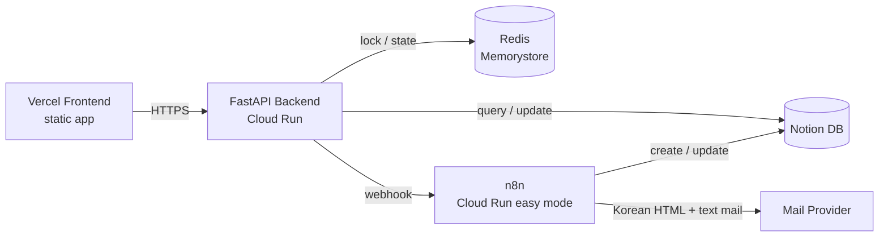

# Smart Timelabs Onboarding Project

This repository implements a Q&A service that follows the `inquiry submission -> admin processing -> completion notification` flow. It includes a frontend, FastAPI backend, n8n workflow exports, and Notion/Redis/Cloud Run automation scripts in one place.

The core structure consists of four parts.

1. The canonical source of inquiries is the `Notion DB`.
2. The `FastAPI Backend` handles input validation, admin authentication, Redis-based concurrency control, and n8n calls.
3. `n8n` handles Notion storage/update and Korean email delivery.
4. `Redis` handles duplicate registration prevention and serialized admin status updates for the same inquiry.


## 1. Summary of Requirement Coverage

The current implementation includes:

- Public inquiry registration API
- Admin login and session persistence API
- Admin inquiry list/detail/status update APIs
- n8n registration workflow call on inquiry registration
- n8n completion workflow call on inquiry completion
- Notion DB storage and status/result synchronization
- Admin and inquirer email delivery
- Duplicate prevention based on `name + title`
- Duplicate control with Redis lock under concurrent requests
- Frontend static app and Vercel deployment

## 2. Architecture at a Glance



The backend directly uses Redis and Notion, while registration/completion workflows and email delivery are delegated to n8n.

### Separation of responsibilities

- Frontend: provides public inquiry registration and admin pages; calls only backend APIs.
- Backend: handles input validation, admin authentication, Redis state management, and n8n webhook calls.
- Redis: enforces inquiry registration mutual exclusion, tracks deduplication state, and serializes admin status changes.
- n8n: handles Notion persistence/update and Korean `HTML + text` email delivery.
- Notion DB: canonical source of inquiries.

Decisions are summarized in ADRs.

- [ADR Index](/home/soonvro/Projects/01_Active/smart_timelabs_onboarding/docs/adr/000_index.md)
- [ADR 005](/home/soonvro/Projects/01_Active/smart_timelabs_onboarding/docs/adr/005_문의_주_저장소로_Notion_DB_사용_및_Redis_동시성_제어_채택.md)
- [ADR 006](/home/soonvro/Projects/01_Active/smart_timelabs_onboarding/docs/adr/006_n8n_배포_전략으로_Cloud_Run_easy_mode_채택.md)

## 3. Key Flows

### Inquiry Registration

1. Backend validates the input values.
2. It calculates a `dedup_key` from `name + title`.
3. It acquires `lock:inquiry:{dedup_key}` from Redis.
4. It checks Redis state and the Notion `DedupKey` to determine duplicates.
5. If not duplicate, backend calls the n8n registration workflow.
6. n8n creates the Notion page and sends the admin email.
7. Backend marks Redis state as `confirmed`.

### Admin Status Change

1. Backend acquires `lock:page:{notion_page_id}` from Redis.
2. `Processing` is reflected directly in Notion status by the backend.
3. `Completed` triggers the backend to call the n8n completion workflow.
4. n8n updates Notion `Status/Resolution` and sends emails to both requester and admin.

Duplicate prevention details are documented in [redis_중복_방지_플로우.md](/home/soonvro/Projects/01_Active/smart_timelabs_onboarding/docs/design/redis_중복_방지_플로우.md).

## 4. Repository Layout

```text
backend/
  app/
    main.py              FastAPI routes
    services.py          Inquiry creation/status change business logic
    notion_gateway.py    Notion lookup/update
    n8n_gateway.py       n8n webhook calls
    redis_store.py       Redis lock/state persistence
frontend/
  index.html            Static entrypoint
  app.js                Inquiry/admin UI
  config.js             API base URL config
n8n/workflows/
  001_문의_등록.json
  002_문의_완료.json
automation/
  notion_*.py           Notion DB automation
  n8n_*.py              n8n deployment/bootstrap/testing automation
  redis_service.py      Redis deployment automation
  backend_*.py          backend deployment/integration test automation
scripts/
  CLI entrypoint bundle
tests/
  Unit tests and integration tests
docs/
  prd.md
  adr/
  design/
```

## 5. Main APIs

### Public APIs

- `POST /api/v1/inquiries`

### Admin Auth

- `POST /api/v1/admin/session`
- `GET /api/v1/admin/session`
- `DELETE /api/v1/admin/session`

### Admin Inquiry Management

- `GET /api/v1/admin/inquiries`
- `GET /api/v1/admin/inquiries/{notion_page_id}`
- `PATCH /api/v1/admin/inquiries/{notion_page_id}`

The base state values are `등록됨`, `처리중`, `완료됨`. Internal Notion mapping uses `Registered`, `In Progress`, `Completed`.

## 6. Frequently Used Commands

This repository uses `Justfile` as the single entry point.

### Local development

```bash
just backend-dev
just frontend-dev port=3000
```

### Testing

```bash
just backend-test
just test
just backend-integration-test
just n8n-integration-test
```

### Notion / n8n

```bash
just notion-db action=ensure
just n8n-cloud-run action=deploy
just n8n-bootstrap action=sync
just n8n-bootstrap action=verify
```

### Backend / Frontend Deployment

```bash
just backend-cloud-run action=deploy
just frontend-vercel-deploy
just frontend-vercel-deploy-prod
```

### Operations checks

```bash
just redis action=describe
just backend-proxy port=8081
just backend-docker-run port=8080
```

See the full list of recipes in [Justfile](/home/soonvro/Projects/01_Active/smart_timelabs_onboarding/Justfile).


## 7. Reference Documents

- PRD: [docs/prd.md](/home/soonvro/Projects/01_Active/smart_timelabs_onboarding/docs/prd.md)
- ADR index: [docs/adr/000_index.md](/home/soonvro/Projects/01_Active/smart_timelabs_onboarding/docs/adr/000_index.md)
- Redis deduplication details: [docs/design/redis_중복_방지_플로우.md](/home/soonvro/Projects/01_Active/smart_timelabs_onboarding/docs/design/redis_중복_방지_플로우.md)
- n8n deployment procedure: [docs/n8n/cloud_run_easy_mode_배포_절차.md](/home/soonvro/Projects/01_Active/smart_timelabs_onboarding/docs/n8n/cloud_run_easy_mode_배포_절차.md)
- n8n workflow export overview: [n8n/workflows/README.md](/home/soonvro/Projects/01_Active/smart_timelabs_onboarding/n8n/workflows/README.md)

## 8. Operations Notes

- When n8n workflows are modified, both the exported JSON in the repository and the production workflow must be updated together.
- The completion workflow uses an internal payload contract containing `name` and `title` for mail template rendering.
- Secrets should be stored in a dedicated secret manager, not in this repository.
- n8n Cloud Run easy mode is suitable for evaluation/demo use, but because state can be lost during redeployments, export files must always be kept current.
